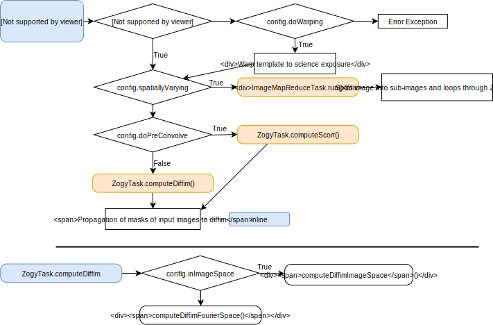

#################################
Package usage and technical notes
#################################

This page is a collection of usage and code related notes about the
image differencing implementation. We do not summarise the Alard-Lupton
(AL) [AL_1998]_ and Zackay, Ofek, Gal-Yam (ZOGY) [ZOGY2016]_ papers
themselves here. 

Usage notes
===========

Supported input data
--------------------

ImageDifferenceTask supports two types of data products as templates,
*coadds* and *calexps*, which can be subtracted from calexp science
exposures *only*. Other combinations of inputs are not supported.  The
input mode is selected by the ``getTemplate`` configurable field.  The
``getTemplate`` subtask is a properly retargetable top level
``pexConfig.ConfigurableField`` with two supported target subtasks:
``GetCoaddAsTemplate`` and ``GetCalexpAsTemplate``.

Enabling processing steps
-------------------------

There is a sequence of pre-subtraction and post-subtraction processing
steps included in ``ImageDifferenceTask`` around the actual
subtraction operation of the images. Including the subtraction
operation itself, these steps can be enabled or disabled by top level
``do<ACTION>`` configuration options. These top-level configuration
options are summarised in :numref:`flowchart1` and
:numref:`flowchart2` (`flowchart source and standalone pdf version
<https://github.com/lsst-dm/diffimTests/tree/master/figure_subtasks>`_
). Some of these top level configuration options are also passed on to
invoked subtasks and influence their functionality. They may not be
specified for the subtasks directly.

.. _flowchart1:

.. figure:: figures/ImageDifference_flowchart.draw.io-Page-1.svg
    :align: center
    :alt: Subtasks page 1

    Top level subtasks and top level configuration options in
    ``ImageDifferenceTask``.

    Following the reading of the template and science images, the task
    starts with the preprocessing of the science exposure on the top
    and ends with post processing steps following the subtraction on
    the bottom.

.. _flowchart2:

    Top level configuration options in ``ZogyTask``.

.. 
	Figure source on github:  
	lsst-dm/diffimTests/figure_subtasks/ImageDifference_flowchart.draw.io

Specifying a coadd as template
------------------------------

Using the ``GetCoaddAsTemplate`` subtask, we specify one or more
science exposures by the ``--id`` general data specification
option. Tract or patch specification as part of the ``--id`` option
are silently ignored. The given (``coaddName``, defaults to "deep")
type coadd is looked up in the same input repository automatically.
As of Butler generation 2, if multiple coadd templates are reachable
through the repository parent references, one of them is picked
automatically.

The subtask detemines the sky corners of a box that fully contains the
science exposure with a configurable boundary
(``templateBorderSize``). The subtask selects all patches of the coadd
skymap that overlap with the science exposure and cuts them
accordingly to assemble the template coadd image. The template coadd
image inherits the coadd WCS. It is an error if there is no
overlapping region. The ``--templateId`` option is silently
ignored. The following example specifies one science exposure and
implicitly the deep coadd residing in the same repository for image
differencing:

.. code-block:: bash

	imageDifference.py repo/ingested/ --id visit=410915 filter=g
	   ccdnum=25

``GetCoaddAsTemplate`` also supports loading ``DcrModel`` coadds and
produce a color corrected template matching the ``filter`` of the
science exposure. 
	
Specifying a calexp as template
-------------------------------

Using the ``GetCalexpAsTemplate`` subtask, we can select two calexp
data products for subtraction.  The ``--id`` option specifies a data
reference of one or more science exposures (calexp).  The
``--templateId`` specifies a data reference for the template
(calexp). Fields that are not specified for the template are inherited
from the science exposure data reference.  The following example
subtract visit 410915 ccdnum 25 (template) from 411055 ccdnum 25
(science exposure):
  
.. code-block:: bash

	imageDifference.py repo/calibimgs --id visit=411055
	   ccdnum=25 --templateId visit=410915

Implementation notes
====================
		
General
-------

If the two images have the same origin and extent (same WCS) the
subtraction is performed pixel by pixel. Otherwise, the *template*
exposure is warped and resampled into the WCS frame of the science
exposure.

The AL kernel fitting is entirely implemented in C++, an adaptation of
the `hotpants <https://github.com/acbecker/hotpants>`_ C package
by Becker, while the ZOGY algorithm is entirely implemented in
Pyton based on mostly on the ``numpy`` FFT functionality.

Beside the top level configuration options, the AL algorithm has its
own set of separate configuration parameters, while the ZOGY algorithm
does not have any algorithm specific options.

Alard-Lupton algorithm 
----------------------

The Alard-Lupton numerical fitting for the coefficients (of the
composing basis kernel functions) of the image convolution kernel is
performed independently on a number of stamp images around selected
sources. These independent solutions are called *kernel candidates*
throughout the code. The final kernel solution model for the whole
image is a smoothly varying spatial fit of the coefficients as a
function of the image pixel coordinates.

If ``convolveTemplate==False`` the science exposure is convolved and
then the template is subtracted from the science image.

The performance of the AL algorithm was studied in details in the
[Becker_LDM-227]_ report. This study forms the basis of the AL
algorithm default values; the degree of the polynomial
multiplicator of the Gaussian kernel basis functions (``degGauss``),
the degree of the polynomial that is fitted to the spatial variaton of
the solution coefficients accross the image (``spatialKernelOrder``)
and the default detection thresholds (5.5 sigma). As a legacy of this
study, the ``Winter2013ImageDifferenceTask`` is still available in
``imageDifference.py`` though it is unclear which test data repository
it requires.

Due to noise in the template image, convolving the template introduces
correlation in the noise in the template image. The AL algorithm was
improved by an additional *afterburner* decorrelation to remove the
noise correlation in the image difference. The implemented
decorrelation method and its mathematical formulae of the
decorrelation kernel is summarised and studied in [Reiss_DMTN-021]_.

Zackay-Ofek-Gal-Yam algorithm
-----------------------------

[ZOGY2016]_ is free from the assumption that the template is noise
free or specially selected by any other means. We simply deal with two
images with different PSFs and noise characteristics (sigma). In the
basic version of the algorithm, the random noise in the pixels are
assumed to be background dominated i.e. uncorrelated between pixels
and independent of the pixel values. Also we assume that the noise has
zero expectation value i.e. the expectation value of the random noise
is already removed. ZOGY shows that if these assumptions hold, the
difference image noise is also independent and identically distributed
over its pixels (white) by construction, there is no need to
decorrelate the noise in the difference image.

Following the variance addition rule of the difference of uncorrelated
random variables, exactly the same steps are repeated on the exposure
variance planes as on the data planes, only the subtraction step is
replaced by addition.

The *nan* values are removed from the science and template images
before Fourier transformations and replaced by the image mean
values. On the immage difference, the mask plane ``UNMASKEDNAN`` is
set for pixels where originally any of the two inputs or the
difference result is *nan*.

Pre-convolution is not implemented in the ZOGY algorithm. In case of
the ZOGY algorithm, the ``doPreConvolve==True`` config option selects
the *detection likelihood* image to be returned *instead of* the
difference image.  Under the assumptions of the algorithm, this image
carries the likelihood ratio test statistic values similarly to the
usual match filter-convolved image and can be used for threshold
source detections. The ``S`` detection likelihood (or score) image
(eq. 12 in [ZOGY2016]_) and its *corrected variance* ``S_var`` (the
*denominator* of eq. 25 [ZOGY2016]_) are calculated and returned,
following the *simple* correction steps presented in the paper Section
3.3. This signal correction is introduced to account for the source
noise (bright sources) and also for other systematic noise
sources. The iterative approach of section 3.5 is not implemented.

References
==========

.. [AL_1998] Alard, C.; Lupton, Robert H. A Method for Optimal Image
              Subtraction

.. [Reiss_DMTN-021] Reiss J. David, Lupton, Robert H. DMTN-021:
		    Implementation of Image Difference Decorrelation
	      
.. [ZOGY2016] Zackay B., Ofek E. O., Gal-Yam A.,
	      Proper Image Subtraction—Optimal Transient Detection,
	      Photometry, and Hypothesis Testing, 2016, ApJ, 830, 27

.. [Becker_LDM-227] Becker A. et al. LDM-227 Report on Late Winter2013
		    Production: Image Differencing
